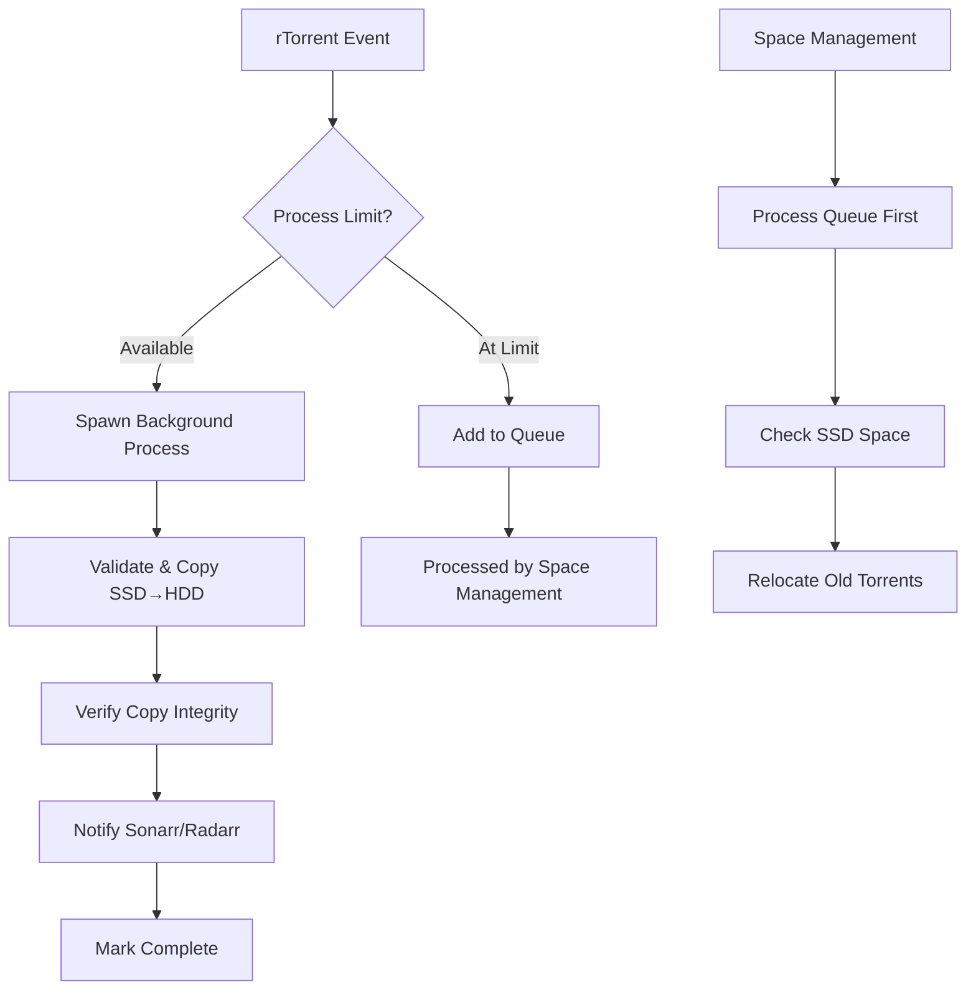

# rFlood with Integrated Pyrosimple-Manager

An enhanced rFlood container with integrated pyrosimple-manager featuring intelligent background processing, security hardening, and enterprise-grade torrent management capabilities.

## 🚀 Features

### **Background Processing Architecture**
- **Non-blocking execution**: Script returns immediately to rTorrent, preventing UI freezes
- **Child process isolation**: Each torrent processes in dedicated background process
- **Intelligent queueing**: Torrents automatically queue when process limits reached
- **Process monitoring**: Real-time tracking of background operations
- **Crash recovery**: Automatic detection and recovery of stuck processes

### **Enterprise Security**
- **Path traversal protection**: Comprehensive validation prevents directory escape attacks
- **Input sanitization**: All user inputs validated and sanitized for safe operation
- **Resource limits**: Configurable process and disk space limits prevent system overload
- **Atomic file operations**: Transactions designed to be safe and recoverable
- **Audit logging**: Comprehensive logging for security and debugging

### **Smart Space Management**
- **SSD cache optimization**: Intelligent relocation of older torrents
- **File locking**: Single-instance space management prevents race conditions
- **Configurable thresholds**: Customizable space limits and behavior
- **Background processing**: Space management runs independently without blocking
- **Copy verification**: Ensures data integrity with multiple validation methods

### **Advanced Arr Integration**
- **Targeted notifications**: Uses downloadClientId for efficient Arr scanning
- **Health monitoring**: Built-in connectivity and API validation
- **Configurable endpoints**: Support for custom Arr configurations
- **Error recovery**: Robust error handling for network issues

## Quick Start

### 1. Prepare Environment

Copy and configure your environment:

```bash
cd downloads
cp env.example .env
# Edit .env with your actual paths, API keys, and settings
```

**Critical Environment Variables:**

```env
# Core paths - MUST match your volume mounts exactly
DOWNLOAD_PATH_SSD=/downloads/ssd    # Fast storage for active downloads
FINAL_DEST_BASE_HDD=/downloads/hdd  # Permanent storage for completed files

# Process management
MAX_CONCURRENT_PROCESSES=3          # Balance performance vs resource usage
DISK_SPACE_THRESHOLD_GB=100        # Space threshold for cleanup (GB)

# Security and reliability  
VERIFICATION_ENABLED=true           # Enable copy verification (recommended)
COPY_RETRY_ATTEMPTS=3              # Retry attempts for failed operations

# Arr integration
NOTIFY_ARR_ENABLED=true            # Enable Sonarr/Radarr notifications
SONARR_API_KEY=your_sonarr_key     # Required for Sonarr integration
RADARR_API_KEY=your_radarr_key     # Required for Radarr integration
```

### 2. Build and Deploy

```bash
cd downloads/rflood-next
docker build -t rflood-next:latest .

cd ..
docker compose up -d rflood
```

### 3. Verify Operation

```bash
# Check container health
docker exec rflood python /app/pyrosimple-manager/healthcheck.py

# Monitor real-time status
docker exec rflood python /app/pyrosimple-manager/main.py --status

# View logs
docker logs rflood -f
```

## Configuration Reference

### Core Environment Variables

| Variable | Default | Description |
|----------|---------|-------------|
| `DOWNLOAD_PATH_SSD` | `/downloads/ssd` | **CRITICAL**: Fast storage path for active downloads |
| `FINAL_DEST_BASE_HDD` | `/downloads/hdd` | **CRITICAL**: Permanent storage path for completed files |
| `SCGI_URL` | `/dev/shm/rtorrent.sock` | rTorrent SCGI connection (socket or HTTP) |
| `MAX_CONCURRENT_PROCESSES` | `3` | Maximum simultaneous torrent processing operations |
| `DISK_SPACE_THRESHOLD_GB` | `100` | Free space threshold (GB) to trigger cleanup |
| `COPY_RETRY_ATTEMPTS` | `3` | Number of retry attempts for failed copy operations |
| `VERIFICATION_ENABLED` | `true` | Enable copy verification (size/count validation) |

### Arr Integration

| Variable | Default | Description |
|----------|---------|-------------|
| `NOTIFY_ARR_ENABLED` | `true` | Enable Sonarr/Radarr notifications |
| `SONARR_URL` | `http://sonarr:8989` | Sonarr API endpoint URL |
| `SONARR_API_KEY` | *(empty)* | **Required**: Sonarr API key for notifications |
| `SONARR_TAG` | `sonarr` | Torrent label for TV shows |
| `RADARR_URL` | `http://radarr:7878` | Radarr API endpoint URL |
| `RADARR_API_KEY` | *(empty)* | **Required**: Radarr API key for notifications |
| `RADARR_TAG` | `radarr` | Torrent label for movies |

### Advanced Configuration

| Variable | Default | Description |
|----------|---------|-------------|
| `LOG_LEVEL` | `INFO` | Logging verbosity (DEBUG, INFO, WARNING, ERROR) |
| `LOG_FILE` | `/config/log/pyrosimple-manager.log` | Log file location |
| `LOCK_DIR` | `/config/pyrosimple-manager-locks` | Directory for locks and queue files |

### Volume Mapping Requirements

```yaml
services:
  rflood:
    volumes:
      - /your/config/path:/config                 # Container configuration
      - /your/fast/ssd/storage:/downloads/ssd    # CRITICAL: Fast SSD cache
      - /your/permanent/storage:/downloads/hdd   # CRITICAL: Permanent HDD storage
```

## Operational Guide

### Background Processing Flow



### Directory Structure Inside Container

```
/app/
├── rtorrent                       # rTorrent binary
├── flood/                         # Flood UI files
└── pyrosimple-manager/           # Management scripts
    ├── main.py                   # Main entry point
    ├── core.py                   # Core processing logic
    ├── util.py                   # Utility functions
    ├── config.py                 # Configuration management
    ├── logger.py                 # Logging system
    └── healthcheck.py            # Health monitoring

/config/
├── rtorrent.rc                   # rTorrent configuration
├── log/
│   └── pyrosimple-manager.log   # Application logs
└── pyrosimple-manager-locks/     # Process coordination
    ├── queue/                    # Pending torrent queue
    │   └── *.queue              # Individual queue files
    └── *.lock                   # Process lock files

/downloads/
├── ssd/                         # Fast SSD cache
│   ├── sonarr/                 # TV shows (active downloads)
│   └── radarr/                 # Movies (active downloads)
└── hdd/                        # Permanent HDD storage
    ├── sonarr/                 # TV shows (completed)
    └── radarr/                 # Movies (completed)
```

## Command Reference

### Status and Monitoring

```bash
# Comprehensive status check
docker exec rflood python /app/pyrosimple-manager/main.py --status

# Health check with detailed output
docker exec rflood python /app/pyrosimple-manager/healthcheck.py

# Real-time log monitoring
docker exec rflood tail -f /config/log/pyrosimple-manager.log

# Configuration validation
docker exec rflood python -c "import config; config.show_config_summary()"
```

### Queue Management

```bash
# Process queued torrents manually
docker exec rflood python /app/pyrosimple-manager/main.py --process-queue

# Clear all queued torrents (emergency)
docker exec rflood python /app/pyrosimple-manager/main.py --clear-queue

# Force space management run
docker exec rflood python /app/pyrosimple-manager/main.py
```

### Testing and Debugging

```bash
# Test mode (no actual changes)
docker exec rflood python /app/pyrosimple-manager/main.py --dry-run

# Debug level logging
docker exec rflood env LOG_LEVEL=DEBUG python /app/pyrosimple-manager/main.py --dry-run

# Test specific torrent processing
docker exec rflood python /app/pyrosimple-manager/main.py --dry-run TORRENT_HASH
```

## Monitoring and Troubleshooting

### Status Monitoring

The `--status` command provides comprehensive system information:

```bash
$ docker exec rflood python /app/pyrosimple-manager/main.py --status

Checking background process status...
Found 2 running background processes:
  PID 1234: python main.py --child-process --child-hash ABCD1234...
  PID 1235: python main.py --child-process --child-hash EFGH5678...

Space management process is currently running

Queue status: 3 torrent(s) waiting for processing
  - HASH1 (queued 2.5 minutes ago)
  - HASH2 (queued 1.2 minutes ago)  
  - HASH3 (queued 0.3 minutes ago)
```

### Health Monitoring

```bash
$ docker exec rflood python /app/pyrosimple-manager/healthcheck.py

=== Pyrosimple-Manager Health Check ===
✓ Configuration validation passed
✓ rTorrent connection successful
✓ SSD path accessible and writable
✓ HDD path accessible and writable
✓ Lock directory accessible
✓ Sonarr API connectivity confirmed
✓ Radarr API connectivity confirmed
✓ No stuck processes detected

System Status: HEALTHY
```

### Log Analysis

**Main Application Logs:**
```bash
# Follow live logs
docker exec rflood tail -f /config/log/pyrosimple-manager.log

# Search for errors
docker exec rflood grep ERROR /config/log/pyrosimple-manager.log

# View recent activity
docker exec rflood tail -50 /config/log/pyrosimple-manager.log
```

**Container Logs:**
```bash
# All container output
docker logs rflood

# Follow live container logs
docker logs rflood -f

# Last 100 lines
docker logs rflood --tail 100
```

## Troubleshooting Guide

### 🚨 Common Issues

#### **Queue Building Up**

**Symptoms**: Many torrents stuck in queue, slow processing

**Diagnosis:**
```bash
docker exec rflood python /app/pyrosimple-manager/main.py --status
```

**Solutions:**
1. **Increase process limit**: Set `MAX_CONCURRENT_PROCESSES=5` (or higher)
2. **Manual queue processing**: `docker exec rflood python /app/pyrosimple-manager/main.py --process-queue`
3. **Check system resources**: Ensure sufficient CPU/memory available

#### **Path Validation Errors**

**Symptoms**: "Path outside safe directory" errors in logs

**Diagnosis:**
```bash
# Check volume mounts
docker inspect rflood | grep Mounts -A 20

# Verify environment variables
docker exec rflood env | grep -E "(DOWNLOAD_PATH|FINAL_DEST)"
```

**Solutions:**
1. **Verify volume mounts** match environment variables exactly
2. **Check permissions** on mounted directories
3. **Validate path configuration** in environment file

#### **Space Management Not Running**

**Symptoms**: SSD fills up, no automatic cleanup

**Diagnosis:**
```bash
# Check if space management is stuck
docker exec rflood python /app/pyrosimple-manager/main.py --status

# Check available space
docker exec rflood df -h /downloads/ssd
```

**Solutions:**
1. **Check lock files**: Remove stuck lock files in `/config/pyrosimple-manager-locks/`
2. **Manual space management**: `docker exec rflood python /app/pyrosimple-manager/main.py`
3. **Adjust threshold**: Lower `DISK_SPACE_THRESHOLD_GB` value

#### **Arr Services Not Importing**

**Symptoms**: Files copied but not imported by Sonarr/Radarr

**Diagnosis:**
```bash
# Test API connectivity
docker exec rflood python /app/pyrosimple-manager/healthcheck.py | grep -A5 "Arr Services"

# Check API keys
docker exec rflood env | grep API_KEY
```

**Solutions:**
1. **Validate API keys** are correct and have proper permissions
2. **Check network connectivity** between containers
3. **Review Arr logs** for import errors
4. **Verify download client settings** in Arr services

#### **Container Won't Start**

**Symptoms**: Container exits immediately, health checks fail

**Diagnosis:**
```bash
# Check container logs
docker logs rflood

# Validate configuration
docker run --rm -it --env-file .env rflood-next:latest python -c "
import config
errors, warnings = config.validate_config()
print('Errors:', errors)
print('Warnings:', warnings)"
```

**Solutions:**
1. **Fix environment variables** identified in validation
2. **Check volume permissions** and ownership
3. **Verify base image** is properly built with all dependencies

### 🔧 Performance Optimization

#### **Process Tuning**
```env
# Conservative (slower, less resource usage)
MAX_CONCURRENT_PROCESSES=2

# Aggressive (faster, more resource usage)  
MAX_CONCURRENT_PROCESSES=5

# Balanced (recommended for most systems)
MAX_CONCURRENT_PROCESSES=3
```

#### **Storage Optimization**
```env
# More aggressive cleanup (frees space sooner)
DISK_SPACE_THRESHOLD_GB=50

# Conservative cleanup (keeps more on SSD)
DISK_SPACE_THRESHOLD_GB=150
```

#### **Network Optimization**
- Use local SCGI sockets instead of network connections
- Place Arr services on same Docker network
- Consider dedicated storage networks for high throughput

### 🔐 Security Considerations

#### **File System Security**
- All paths validated against base directories
- Filename sanitization prevents filesystem attacks
- Safe symlink handling prevents directory traversal

#### **Process Security**  
- Child process isolation limits blast radius
- Resource limits prevent DoS via resource exhaustion
- Clean shutdown procedures handle signals properly

#### **Network Security**
- API keys properly validated before use
- Timeout handling prevents hanging connections
- Error handling prevents information disclosure

## Advanced Configuration

### Custom Processing Rules

```bash
# Edit container configuration
docker exec -it rflood vi /config/pyrosimple-manager/config.py

# Restart container to apply changes
docker restart rflood
```

Example customizations:
```python
# Increase retry attempts for unreliable storage
COPY_RETRY_ATTEMPTS = 5

# More aggressive space management
DISK_SPACE_THRESHOLD_GB = 50

# Disable verification for speed (not recommended)
VERIFICATION_ENABLED = False
```

### Integration with External Services

```bash
# Call from external scripts
docker exec rflood python /app/pyrosimple-manager/main.py HASH

# API integration example
curl -X POST webhook-service/torrent-completed \
  -d "docker exec rflood python /app/pyrosimple-manager/main.py $TORRENT_HASH"
```

### Development and Testing

```bash
# Mount development scripts
docker run -v ./pyrosimple-manager:/app/pyrosimple-manager:ro rflood-next

# Run with debug logging
docker exec rflood env LOG_LEVEL=DEBUG python /app/pyrosimple-manager/main.py

# Test configuration changes
docker exec rflood python /app/pyrosimple-manager/main.py --dry-run
```

## Migration Guide

### From Manual Scripts

1. **Backup existing configuration**
2. **Test with `--dry-run` mode** extensively
3. **Monitor queue behavior** during transition
4. **Update rTorrent event handlers** to use new script

### From Other Containers

1. **Export torrent session** data
2. **Map existing volume paths** to new environment variables
3. **Update Arr download client** settings
4. **Verify path mappings** match existing setup

## Security and Compliance

### Security Features

- **Input validation**: All inputs validated for type, range, and format
- **Path sanitization**: Filesystem paths validated against allowed directories
- **Process isolation**: Each operation runs in isolated child process
- **Resource limits**: Configurable limits prevent system exhaustion
- **Audit logging**: All operations logged for security review

### Compliance Considerations

- **Data integrity**: Copy verification ensures data consistency
- **Error recovery**: Robust error handling prevents data loss
- **Access control**: File operations limited to configured directories
- **Monitoring**: Comprehensive logging supports compliance audits

## Support and Maintenance

### Regular Maintenance

```bash
# Weekly health check
docker exec rflood python /app/pyrosimple-manager/healthcheck.py

# Monitor queue status
docker exec rflood python /app/pyrosimple-manager/main.py --status

# Review logs for errors
docker exec rflood grep ERROR /config/log/pyrosimple-manager.log
```

### Performance Monitoring

```bash
# Check processing times
docker exec rflood grep "Finished.*seconds" /config/log/pyrosimple-manager.log

# Monitor space usage
docker exec rflood df -h /downloads/ssd /downloads/hdd

# Track queue length over time
docker exec rflood python /app/pyrosimple-manager/main.py --status | grep "Queue status"
```

### Backup Recommendations

**Critical Data:**
- `/config/` directory (configuration and logs)
- Queue files in `/config/pyrosimple-manager-locks/queue/`
- Environment variable configuration

**Recovery Procedures:**
1. Restore configuration files
2. Rebuild container with same environment
3. Verify all volume mounts are correct
4. Run health check to confirm operation

---

This integration provides enterprise-grade torrent management with security, reliability, and performance optimizations suitable for production deployments. 