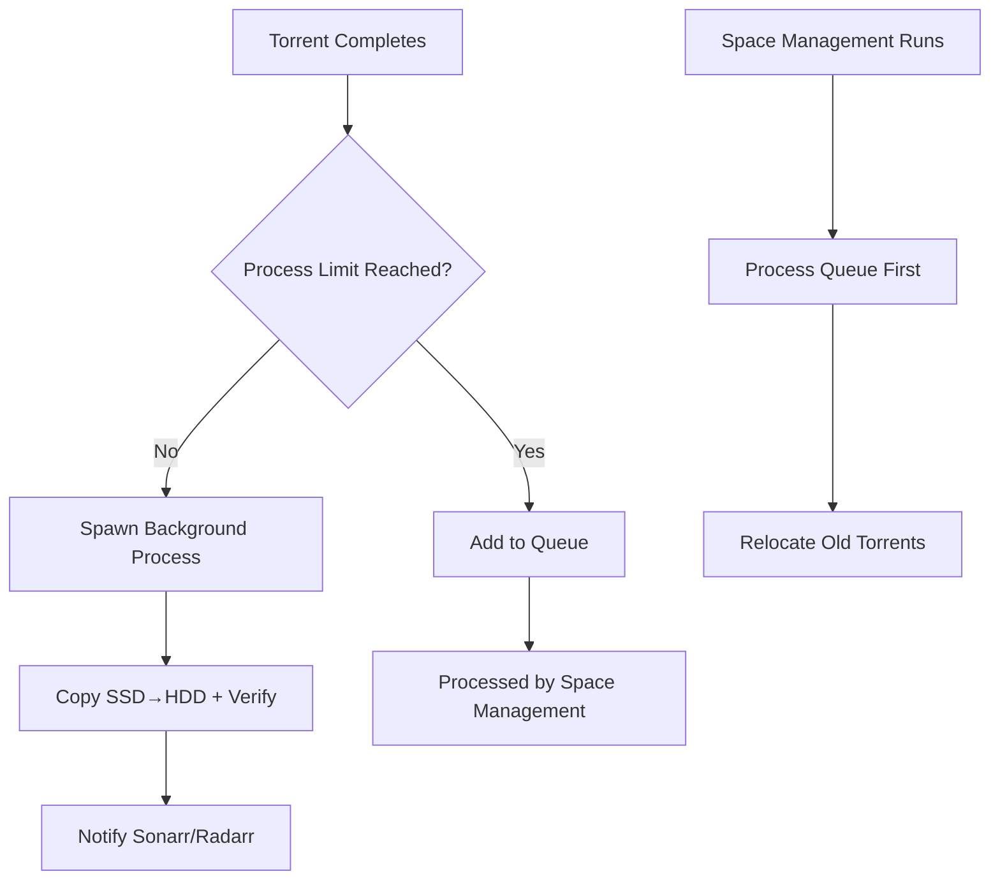

# rTorrent SSD Cache Manager

A robust Python script to manage rTorrent downloads with intelligent SSD caching, background processing, and automatic space management. Features include intelligent queueing, Sonarr/Radarr integration, and comprehensive security protections.

## Features

### 🚀 **Background Processing**
- **Non-blocking execution**: Scripts return immediately to rTorrent, preventing UI locks
- **Child process isolation**: Each torrent processes in its own background process
- **Intelligent queueing**: Torrents queue when process limits are reached (never lost!)
- **Process monitoring**: Track background processes with built-in status commands

### 🔒 **Security & Safety**
- **Path traversal protection**: Validates all file paths to prevent directory escapes
- **Filename sanitization**: Removes dangerous characters from torrent names
- **Input validation**: Comprehensive validation of torrent info and user inputs
- **Safe file operations**: Atomic operations with proper error handling
- **Disk space checking**: Prevents filling up destination storage

### ⚡ **Smart Space Management**
- **SSD cache optimization**: Automatically relocates older torrents when space is low
- **File locking**: Prevents race conditions with single-instance space management
- **Configurable thresholds**: Set custom space limits and retry attempts
- **Copy verification**: Ensures data integrity with size/count validation

### 📡 **Arr Integration**
- **Sonarr/Radarr notifications**: Automatic scan requests after successful copies
- **Targeted scanning**: Uses downloadClientId for efficient imports
- **Health monitoring**: Built-in connectivity tests for Arr services

## Requirements

- **Python 3.7+**
- **pyrosimple** (`pip install pyrosimple[torque]`)
- **psutil** (`pip install psutil`) - for process monitoring
- **requests** (`pip install requests`) - for Arr notifications
- **rTorrent** with XMLRPC/SCGI enabled
- **Optional**: Sonarr/Radarr for media management

## Installation

1. **Install dependencies:**
   ```bash
   pip install pyrosimple[torque] psutil requests
   ```

2. **Configure your environment** (see Configuration section)

3. **Set up rTorrent integration** (see Integration section)

## Configuration

All configuration is handled via environment variables for container deployments:

### Core Settings
```bash
# Storage paths (CRITICAL - must match your volume mounts)
DOWNLOAD_PATH_SSD="/downloads/ssd"          # Fast SSD cache
FINAL_DEST_BASE_HDD="/downloads/hdd"        # Permanent HDD storage

# Connection settings  
SCGI_URL="/dev/shm/rtorrent.sock"           # rTorrent SCGI connection

# Process management
MAX_CONCURRENT_PROCESSES=3                   # Max simultaneous torrent processes
DISK_SPACE_THRESHOLD_GB=100                 # Free space threshold for cleanup
COPY_RETRY_ATTEMPTS=3                       # Retry attempts for failed copies
```

### Arr Integration
```bash
# Notification settings
NOTIFY_ARR_ENABLED=true                     # Enable Arr notifications
SONARR_URL="http://sonarr:8989"            # Sonarr API endpoint
SONARR_API_KEY="your-sonarr-api-key"       # Sonarr API key
RADARR_URL="http://radarr:7878"            # Radarr API endpoint  
RADARR_API_KEY="your-radarr-api-key"       # Radarr API key
SONARR_TAG="sonarr"                        # Label for TV shows
RADARR_TAG="radarr"                        # Label for movies
```

### Advanced Settings
```bash
# Logging
LOG_LEVEL="INFO"                           # DEBUG, INFO, WARNING, ERROR
LOG_FILE="/config/log/pyrosimple-manager.log"

# Locking and queues
LOCK_DIR="/config/pyrosimple-manager-locks" # Lock and queue file location
VERIFICATION_ENABLED=true                   # Enable copy verification
```

## Usage

### Command Line Interface

```bash
# Process specific torrent (spawns background process)
python main.py TORRENT_HASH

# Run space management and process queue (background)  
python main.py

# Show status of all background processes and queue
python main.py --status

# Manually process queued torrents
python main.py --process-queue

# Clear all queued torrents (emergency use)
python main.py --clear-queue

# Test mode - no actual changes
python main.py --dry-run TORRENT_HASH
```

### Integration with rTorrent

Add to your `rtorrent.rc`:

```bash
# When download completes, process it (non-blocking)
method.set_key = event.download.finished,process_complete,"execute.nothrow=python3,/path/to/main.py,$d.hash="

# Optional: Process new torrents for queue management
method.set_key = event.download.inserted_new,process_new,"execute.nothrow=python3,/path/to/main.py"
```

## How It Works

### Processing Flow



### Security Architecture

- **Path Validation**: All file paths validated against base directories
- **Input Sanitization**: Torrent names and labels sanitized for safe filesystem operations
- **Process Isolation**: Each operation runs in isolated child processes
- **Resource Limits**: Configurable limits prevent system overload
- **Atomic Operations**: File operations designed to be atomic and recoverable

### Directory Structure

```
/downloads/ssd/                    # SSD cache (fast, temporary)
├── sonarr/                        # TV shows
│   └── Show.S01E01.mkv           # Active downloads
└── radarr/                        # Movies
    └── Movie.2023.mkv

/downloads/hdd/                    # HDD storage (permanent)
├── sonarr/                        # Organized by label
│   └── Show.S01E01.mkv           # Completed transfers
└── radarr/
    └── Movie.2023.mkv

/config/pyrosimple-manager-locks/   # Process coordination
├── queue/                         # Pending torrent queue
│   └── HASH_timestamp.queue      # Queued torrents
└── space_management.lock          # Space management lock
```

## Monitoring and Troubleshooting

### Status Monitoring

```bash
# Check all background processes and queue status
python main.py --status

# Example output:
# Found 2 running background processes:
#   PID 1234: python main.py --child-process --child-hash HASH1
#   PID 1235: python main.py --child-process --child-hash HASH2
# 
# Space management process is currently running
#
# Queue status: 3 torrent(s) waiting for processing
#   - HASH3 (queued 2.5 minutes ago)
#   - HASH4 (queued 1.2 minutes ago)
```

### Log Analysis

```bash
# Main process logs
tail -f /config/log/pyrosimple-manager.log

# Container logs (if using Docker)
docker logs container_name

# Debug mode
LOG_LEVEL=DEBUG python main.py --dry-run
```

### Common Issues

**Queue building up?**
```bash
# Check process limits
python main.py --status
# Increase MAX_CONCURRENT_PROCESSES if needed

# Manually process queue
python main.py --process-queue
```

**Path errors?**
- Verify DOWNLOAD_PATH_SSD and FINAL_DEST_BASE_HDD are correct
- Check file permissions on both directories
- Ensure paths are properly mounted (in containers)

**Space management not working?**
- Check DISK_SPACE_THRESHOLD_GB setting
- Verify space management isn't already running
- Check logs for lock file issues

## Performance Tuning

### Process Management
- `MAX_CONCURRENT_PROCESSES=3` - Balance between speed and system load
- Higher values = faster processing but more resource usage
- Lower values = more conservative, longer queue processing

### Storage Optimization
- Set `DISK_SPACE_THRESHOLD_GB` to 10-20% of SSD capacity
- Use fast filesystems (ext4, xfs) for SSD cache
- Ensure good I/O bandwidth between SSD and HDD

### Network Optimization
- Place Arr services on same network for faster notifications
- Use local SCGI sockets instead of network connections when possible

## Security Features

### Path Protection
- **Validation**: All paths checked against allowed base directories
- **Sanitization**: Dangerous characters removed from filenames
- **Bounds checking**: Prevents access outside designated areas

### Process Security
- **Isolation**: Each torrent processes in separate child process
- **Resource limits**: Configurable concurrent process limits
- **Clean shutdown**: Proper signal handling and cleanup

### Input Validation
- **Hash validation**: Torrent hashes validated for format and length
- **Size validation**: File sizes checked for reasonable bounds
- **Configuration validation**: All settings validated on startup

## Contributing

1. **Security**: Report security issues privately
2. **Features**: Submit feature requests with use cases
3. **Bugs**: Include logs, configuration, and reproduction steps
4. **Code**: Follow existing patterns, add tests for new features

## License

MIT License - see LICENSE file for details

---

**Note**: This software is designed for use in containerized environments but can run on bare metal with proper Python environment setup. 